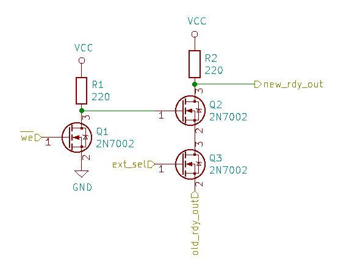

# Control unit rev. 1
Doesn't work at all: because of undefined transition states of ROM outputs random values are written into IR, A, and B.

# Registers rev. 1

## Clock phase
To work with control unit rev. 2, registers rev. 1 should be modified: pin 1 of U1 should be disconnected from clk and connected to ~clk. To do so, cut the track going west from pin 1 of U1 and solder pin 1 and pin 4 together using a short thin wire.

## Clock ringing
The CLK line rings a lot which causes total unpredictable mayhem. To overcome ringing, cut the track coming from pin 6 of U34 on the back side of the board under the chip and solder a 47 Ohm resistor into the gap. The resistor will damp parasitic oscillations.

## First instruction
Normally after reset the first instruction is not executed because of rewiring the clock phase (clock starts from 0, should start from 1 to begin a valid instruction cycle).

# ROM
All ROM chips used in ALU rev. 1, IO rev. 1, control unit rev. 1 have data pins D6 and D7 swapped. To workaround, use `tools/flip67.py` on the firmware files before flashing.

# Control rev. 2
The schematic of this board has an error: the n_oe_mem signal should be generated by a NOR gate (see control_unit.v). Instead, NAND gate U9A is used. To fix this error:
1. Unsolder U9. Cut the two tracks coming from pins 1 and 2. Solder U9 back.
2. Unsolder U16. Cut the small track between the pins 9 and 10. Cut the two tracks connecting pins 13 and 9 to GND. Solder U16 back.
3. Solder a wire to connect pin 11 of U2 and pins 13 and 12 of U16 (n_op_st signal).
4. Solder pins 11 and 10 of U16 together.
5. Solder a wire to connect pin 9 of U16 and pin 2 of U4 (n_cycle signal).
6. Solder a wire to connect pin 8 of U16 and pins 1 and 2 of U9 (oe_mem).

As a result, U9A will be used as an inverter, U16C as an OR gate and U16D as a repeater to make soldering easier.

# ALU rev. 2
Sometimes a high-frequency noice of unknown source appears. To reproduce (and test), use the following code:
```
ldi a, 127
ldi b, -127
sub a, b
```
The noice happens when the `sub` instruction is executed. Noice can be checked on any VCC pin on the ALU board or on the sa or sb buses.

To overcome this problem, solder a 10 pF capacitor between pins 1 and 7 of U36. Somehow it helps.

# IO rev. 2
Expansion boards can't be connected: connectors J2 and J6 are placed too deep into the board.

Workaround: cut ~5 mm of the board from the right side. Solder pin 6 of J6 to VCC with a wire. This way one board can be connected.

# VGA rev. 1
The `rdy_out` signal is incorrect. The following formula must be implemented:
```
new_rdy_out = ~ext_sel | n_we | old_rdy_out
```
The signal `new_rdy_out` goes to the gate of Q1 instead of `rdy_out`. The `old_rdy_out` is the signal that is produced by the pin 3 of U24. Cut the wire coming from the gate of Q1.

The formula can be implemented with three additional N-MOSFETs (2N7002 work fine):


There are still glitches remaining even after this fix. Their root cause is a subject to further investigation.
